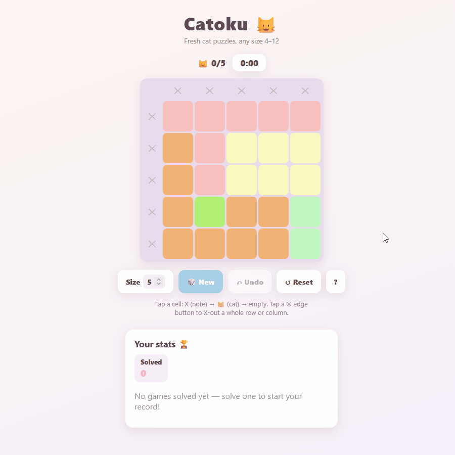
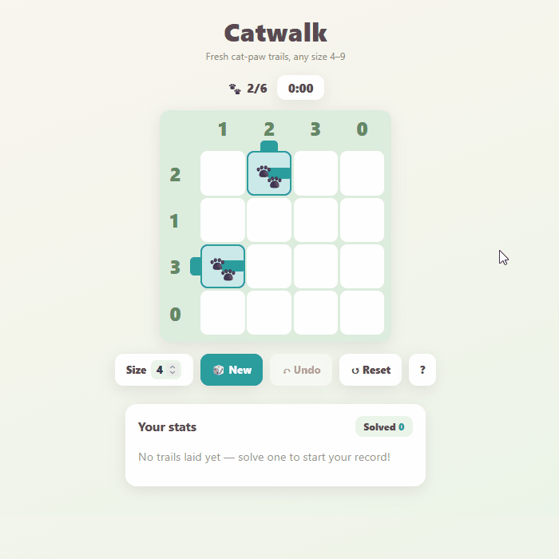
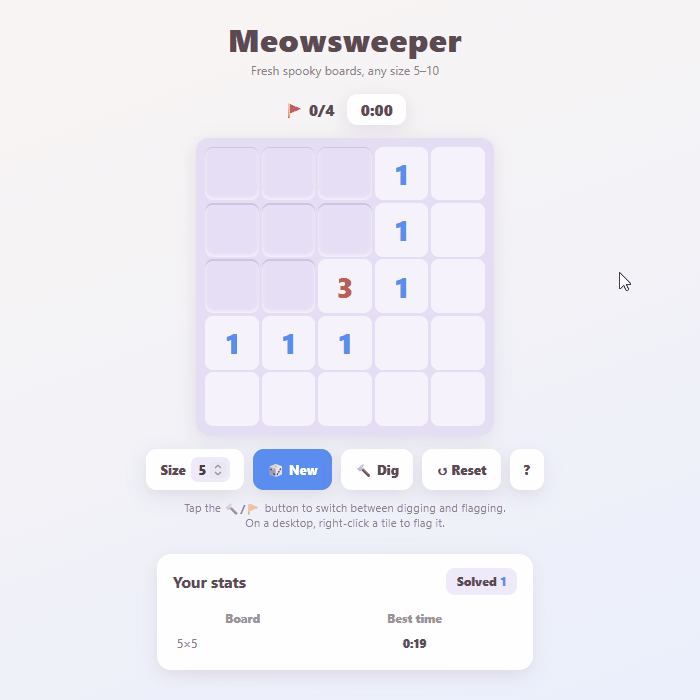
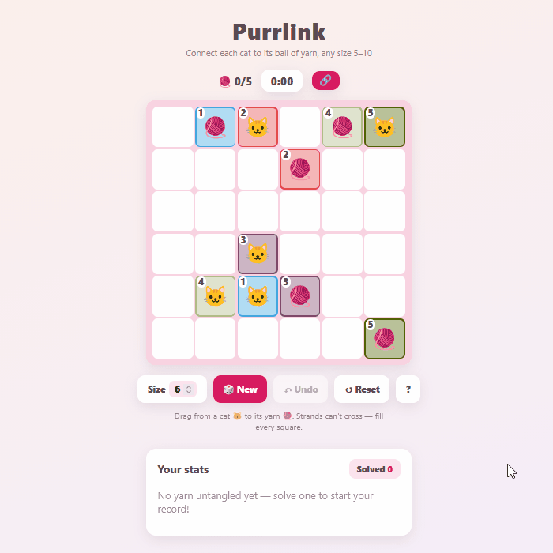

# Kattenspellen

*Kattenspellen* (/ˈkɑtə(n)ˌspɛlə(n)/, "KAH-tuhn-SPEH-luhn") is 🇳🇱 Dutch for "cat games".

Cat themed grid puzzle games, completely free to play, with no ads and no telemetry. Play the daily challenge or generate as many games as you'd like across any difficulty. Keep track of your skill through local-browser stats.

Play at **[kattenspellen.github.io/games](https://kattenspellen.github.io/games/)**.

## Games

### 🐱 [Catoku](https://kattenspellen.github.io/games/catoku/)

A "Queens"-style logic puzzle with cats. One cat per row, column, and color region.

### 🐾 [Catwalk](https://kattenspellen.github.io/games/catwalk/)

A "Train Tracks"-style logic puzzle. Lay one connected paw trail to match the row and column counts.

### 🙀 [Meowsweeper](https://kattenspellen.github.io/games/meowsweeper/)

A "Minesweeper"-style logic puzzle. Clear every safe tile and flag the spooky things.

### 🧶 [Purrlink](https://kattenspellen.github.io/games/purrlink/)

A "Numberlink"-style logic puzzle. Connect each cat to its ball of yarn — no crossings, fill every square.

